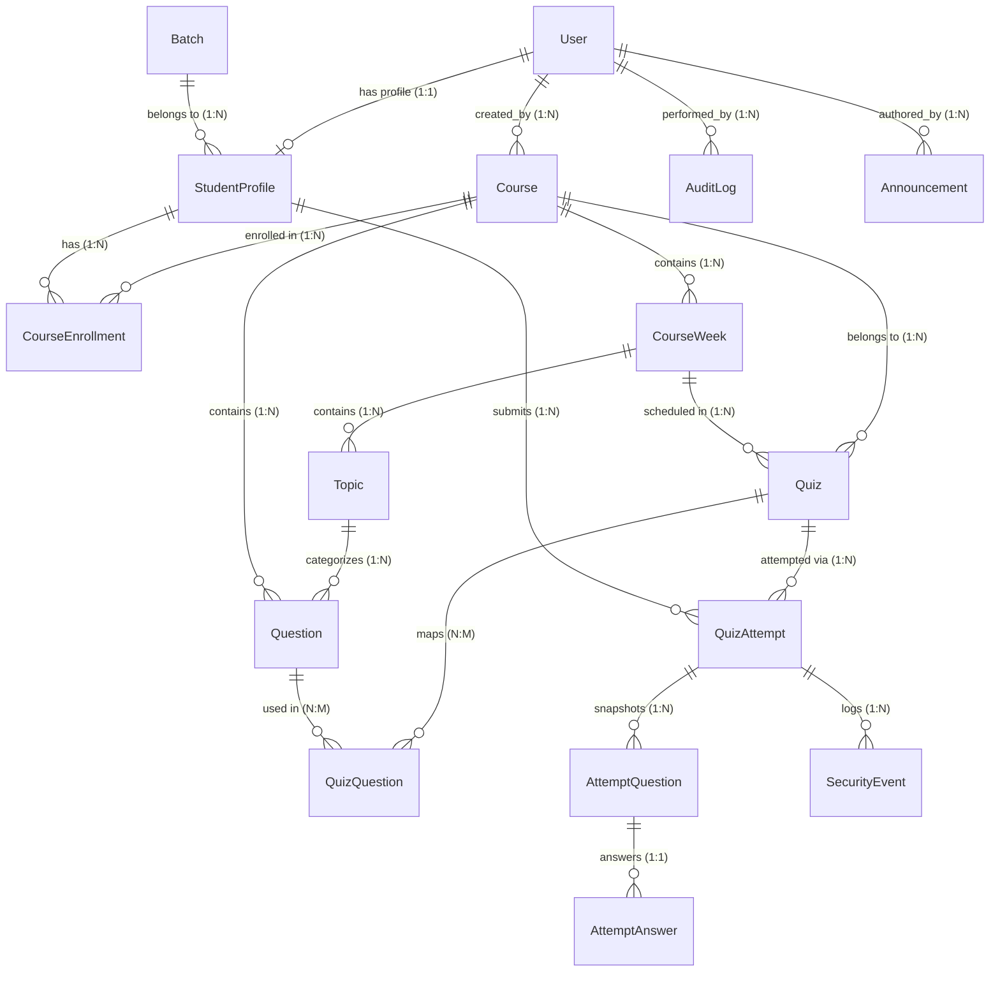

# PostgreSQL Database Architecture & ER Design
## KDTechX Learning & Assessment Portal
**Version:** 1.0.0-PROD-RC  
**Target Engine:** PostgreSQL 16+  
**Status:** Approved for Implementation (Phase 0 Discovery)  

---

## 1. Relational Entity Relationship (ER) Diagram



---

## 2. Table Specifications & Schema Definitions

### 2.1 Accounts & Identity

#### Table: `accounts_user`
| Column | Type | Constraints | Description |
|---|---|---|---|
| `id` | UUID / BigAutoField | PRIMARY KEY | Unique user identifier |
| `username` | VARCHAR(150) | UNIQUE, NOT NULL, INDEX | Login identifier |
| `email` | VARCHAR(254) | UNIQUE, NOT NULL, INDEX | System notification email |
| `password` | VARCHAR(128) | NOT NULL | PBKDF2 / Argon2 secure hash |
| `role` | VARCHAR(20) | NOT NULL, DEFAULT 'STUDENT' | Enum: `ADMIN`, `STUDENT` |
| `first_name` | VARCHAR(150) | NULLABLE | Given name |
| `last_name` | VARCHAR(150) | NULLABLE | Family name |
| `avatar` | VARCHAR(500) | NULLABLE | Profile image URL |
| `is_active` | BOOLEAN | NOT NULL, DEFAULT TRUE | Soft deactivation flag |
| `is_staff` | BOOLEAN | NOT NULL, DEFAULT FALSE | Django admin accessibility |
| `is_superuser` | BOOLEAN | NOT NULL, DEFAULT FALSE | Superuser status |
| `created_at` | TIMESTAMPTZ | NOT NULL, DEFAULT NOW() | Record creation audit |
| `updated_at` | TIMESTAMPTZ | NOT NULL, DEFAULT NOW() | Last mutation audit |

#### Table: `students_studentprofile`
| Column | Type | Constraints | Description |
|---|---|---|---|
| `id` | UUID / BigAutoField | PRIMARY KEY | Unique profile identifier |
| `user_id` | BIGINT/UUID | UNIQUE, FK(`accounts_user.id`, CASCADE) | One-to-one auth account |
| `student_id` | VARCHAR(50) | UNIQUE, NOT NULL, INDEX | Roll number / Institute ID (e.g. `KDX26001`) |
| `batch_id` | BIGINT/UUID | FK(`batches_batch.id`, SET_NULL), NULLABLE | Assigned training cohort |
| `phone` | VARCHAR(30) | NULLABLE | Contact telephone |
| `status` | VARCHAR(20) | NOT NULL, DEFAULT 'ACTIVE' | Enum: `ACTIVE`, `INACTIVE`, `SUSPENDED` |
| `last_active_at` | TIMESTAMPTZ | NULLABLE | Last system ping timestamp |

#### Table: `batches_batch`
| Column | Type | Constraints | Description |
|---|---|---|---|
| `id` | UUID / BigAutoField | PRIMARY KEY | Batch identifier |
| `name` | VARCHAR(150) | NOT NULL | Cohort name (e.g. "Python Full Stack 2026") |
| `code` | VARCHAR(50) | UNIQUE, NOT NULL, INDEX | Unique cohort code (e.g. `PFS-2026-A`) |
| `description` | TEXT | NULLABLE | Detailed cohort scope |
| `status` | VARCHAR(20) | NOT NULL, DEFAULT 'ACTIVE' | Enum: `ACTIVE`, `COMPLETED`, `ARCHIVED` |
| `created_at` | TIMESTAMPTZ | NOT NULL, DEFAULT NOW() | Creation timestamp |

---

### 2.2 Academic Curriculum & Courses

#### Table: `courses_course`
| Column | Type | Constraints | Description |
|---|---|---|---|
| `id` | UUID / BigAutoField | PRIMARY KEY | Course primary key |
| `name` | VARCHAR(200) | NOT NULL | Display title |
| `code` | VARCHAR(50) | UNIQUE, NOT NULL, INDEX | Course code (e.g. `PY-FS-101`) |
| `description` | TEXT | NOT NULL | Comprehensive overview |
| `category` | VARCHAR(100) | NOT NULL | Domain (e.g. "Full Stack", "Data Science") |
| `level` | VARCHAR(30) | NOT NULL | Enum: `BEGINNER`, `INTERMEDIATE`, `ADVANCED` |
| `duration_weeks` | INTEGER | NOT NULL, CHECK > 0 | Curriculum duration |
| `thumbnail` | VARCHAR(500) | NULLABLE | Cover image URL |
| `status` | VARCHAR(20) | NOT NULL, DEFAULT 'DRAFT' | Enum: `DRAFT`, `PUBLISHED`, `ARCHIVED` |
| `created_by_id` | BIGINT/UUID | FK(`accounts_user.id`, RESTRICT) | Authorizing trainer |
| `created_at` | TIMESTAMPTZ | NOT NULL, DEFAULT NOW() | Timestamp |
| `updated_at` | TIMESTAMPTZ | NOT NULL, DEFAULT NOW() | Timestamp |

#### Table: `courses_courseenrollment`
| Column | Type | Constraints | Description |
|---|---|---|---|
| `id` | UUID / BigAutoField | PRIMARY KEY | Enrollment identifier |
| `student_id` | BIGINT/UUID | FK(`students_studentprofile.id`, CASCADE) | Enrolled student |
| `course_id` | BIGINT/UUID | FK(`courses_course.id`, CASCADE) | Target course |
| `assigned_by_id` | BIGINT/UUID | FK(`accounts_user.id`, SET_NULL), NULLABLE | Trainer assignment audit |
| `assigned_at` | TIMESTAMPTZ | NOT NULL, DEFAULT NOW() | Assignment timestamp |
| `status` | VARCHAR(20) | NOT NULL, DEFAULT 'ENROLLED' | Enum: `ENROLLED`, `COMPLETED`, `DROPPED` |
*Unique Constraint:* `UNIQUE(student_id, course_id)` - Prevents duplicate enrollments.

#### Table: `curriculum_courseweek`
| Column | Type | Constraints | Description |
|---|---|---|---|
| `id` | UUID / BigAutoField | PRIMARY KEY | Week primary key |
| `course_id` | BIGINT/UUID | FK(`courses_course.id`, CASCADE) | Parent course |
| `week_number` | INTEGER | NOT NULL, CHECK > 0 | Sequence index (1, 2, 3...) |
| `title` | VARCHAR(200) | NOT NULL | Module headline (e.g. "Django REST APIs") |
| `description` | TEXT | NULLABLE | Pedagogical objectives |
| `order` | INTEGER | NOT NULL, DEFAULT 0 | Drag-and-drop sort order |
*Unique Constraint:* `UNIQUE(course_id, week_number)`

#### Table: `curriculum_topic`
| Column | Type | Constraints | Description |
|---|---|---|---|
| `id` | UUID / BigAutoField | PRIMARY KEY | Topic primary key |
| `week_id` | BIGINT/UUID | FK(`curriculum_courseweek.id`, CASCADE) | Parent curriculum week |
| `title` | VARCHAR(200) | NOT NULL | Topic title |
| `summary` | TEXT | NULLABLE | Topic briefing |
| `order` | INTEGER | NOT NULL, DEFAULT 0 | Sequence index within week |

---

### 2.3 Question Bank & Item Repository

#### Table: `questions_question`
| Column | Type | Constraints | Description |
|---|---|---|---|
| `id` | UUID / BigAutoField | PRIMARY KEY | Question identifier |
| `course_id` | BIGINT/UUID | FK(`courses_course.id`, CASCADE) | Associated course |
| `topic_id` | BIGINT/UUID | FK(`curriculum_topic.id`, SET_NULL), NULLABLE | Associated topic |
| `question_text` | TEXT | NOT NULL | Prompt, code block, or question body |
| `option_a` | TEXT | NOT NULL | Choice A text |
| `option_b` | TEXT | NOT NULL | Choice B text |
| `option_c` | TEXT | NOT NULL | Choice C text |
| `option_d` | TEXT | NOT NULL | Choice D text |
| `correct_answer` | VARCHAR(1) | NOT NULL, CHECK IN ('A','B','C','D') | Protected answer key |
| `difficulty` | VARCHAR(20) | NOT NULL, DEFAULT 'MEDIUM' | Enum: `EASY`, `MEDIUM`, `HARD` |
| `explanation` | TEXT | NULLABLE | Educational rationale shown post-submit |
| `marks` | NUMERIC(5,2) | NOT NULL, DEFAULT 1.00, CHECK > 0 | Default points value |
| `created_by_id` | BIGINT/UUID | FK(`accounts_user.id`, SET_NULL), NULLABLE | Author audit |
| `created_at` | TIMESTAMPTZ | NOT NULL, DEFAULT NOW() | Timestamp |
| `updated_at` | TIMESTAMPTZ | NOT NULL, DEFAULT NOW() | Timestamp |
*Indexes:* `(course_id, difficulty)`, `(topic_id)`

---

### 2.4 Quizzes, Attempts, Snapshots & Evaluation

#### Table: `quizzes_quiz`
| Column | Type | Constraints | Description |
|---|---|---|---|
| `id` | UUID / BigAutoField | PRIMARY KEY | Quiz primary key |
| `course_id` | BIGINT/UUID | FK(`courses_course.id`, CASCADE) | Target course |
| `week_id` | BIGINT/UUID | FK(`curriculum_courseweek.id`, SET_NULL), NULLABLE | Curriculum linkage |
| `title` | VARCHAR(200) | NOT NULL | Assessment title |
| `description` | TEXT | NULLABLE | Instructions for candidates |
| `duration_minutes` | INTEGER | NOT NULL, CHECK > 0 | Official time allocation |
| `total_marks` | NUMERIC(6,2) | NOT NULL, DEFAULT 100.00 | Computed sum of question weights |
| `pass_percentage` | NUMERIC(5,2) | NOT NULL, DEFAULT 60.00 | Threshold for pass status |
| `start_at` | TIMESTAMPTZ | NOT NULL | Open availability window |
| `deadline` | TIMESTAMPTZ | NOT NULL | Strict close deadline |
| `max_attempts` | INTEGER | NOT NULL, DEFAULT 1, CHECK > 0 | Allowed submissions per candidate |
| `random_questions` | BOOLEAN | NOT NULL, DEFAULT FALSE | Shuffle question presentation |
| `random_options` | BOOLEAN | NOT NULL, DEFAULT FALSE | Shuffle choice presentation |
| `negative_marking` | BOOLEAN | NOT NULL, DEFAULT FALSE | Penalty for incorrect choices |
| `negative_marks` | NUMERIC(4,2) | NOT NULL, DEFAULT 0.25 | Penalty value subtracted per wrong |
| `show_result` | BOOLEAN | NOT NULL, DEFAULT TRUE | Immediate scorecard display |
| `show_answers` | BOOLEAN | NOT NULL, DEFAULT TRUE | Post-evaluation key disclosure |
| `status` | VARCHAR(20) | NOT NULL, DEFAULT 'DRAFT' | Enum: `DRAFT`, `PUBLISHED`, `ARCHIVED` |
| `require_fullscreen` | BOOLEAN | NOT NULL, DEFAULT TRUE | Browser fullscreen deterrence |
| `tab_warning_limit` | INTEGER | NOT NULL, DEFAULT 3 | Maximum tolerated tab switches |
| `created_at` | TIMESTAMPTZ | NOT NULL, DEFAULT NOW() | Timestamp |

#### Table: `quizzes_quizquestion`
| Column | Type | Constraints | Description |
|---|---|---|---|
| `id` | UUID / BigAutoField | PRIMARY KEY | Link primary key |
| `quiz_id` | BIGINT/UUID | FK(`quizzes_quiz.id`, CASCADE) | Associated quiz |
| `question_id` | BIGINT/UUID | FK(`questions_question.id`, CASCADE) | Associated question |
| `order` | INTEGER | NOT NULL, DEFAULT 0 | Master presentation sequence |
| `marks` | NUMERIC(5,2) | NOT NULL, DEFAULT 1.00 | Quiz-specific point override |
*Unique Constraint:* `UNIQUE(quiz_id, question_id)`

#### Table: `attempts_quizattempt`
| Column | Type | Constraints | Description |
|---|---|---|---|
| `id` | UUID / BigAutoField | PRIMARY KEY | Attempt primary key |
| `quiz_id` | BIGINT/UUID | FK(`quizzes_quiz.id`, CASCADE) | Quiz reference |
| `student_id` | BIGINT/UUID | FK(`students_studentprofile.id`, CASCADE) | Candidate profile |
| `attempt_number` | INTEGER | NOT NULL, DEFAULT 1 | Attempt counter (1..max_attempts) |
| `started_at` | TIMESTAMPTZ | NOT NULL, DEFAULT NOW() | Server-locked start time |
| `deadline_at` | TIMESTAMPTZ | NOT NULL | Server-locked hard cutoff |
| `submitted_at` | TIMESTAMPTZ | NULLABLE | Finalization timestamp |
| `status` | VARCHAR(20) | NOT NULL, DEFAULT 'IN_PROGRESS' | Enum: `IN_PROGRESS`, `SUBMITTED`, `TIMED_OUT`, `TERMINATED` |
| `score` | NUMERIC(6,2) | NOT NULL, DEFAULT 0.00 | Server-evaluated marks |
| `percentage` | NUMERIC(5,2) | NOT NULL, DEFAULT 0.00 | Evaluated grade percentage |
| `is_passed` | BOOLEAN | NOT NULL, DEFAULT FALSE | Pass threshold outcome |
| `correct_count` | INTEGER | NOT NULL, DEFAULT 0 | Correct response count |
| `wrong_count` | INTEGER | NOT NULL, DEFAULT 0 | Incorrect response count |
| `unanswered_count` | INTEGER | NOT NULL, DEFAULT 0 | Blank question count |
| `time_taken_seconds` | INTEGER | NOT NULL, DEFAULT 0 | Elapsed evaluation duration |
| `tab_violations` | INTEGER | NOT NULL, DEFAULT 0 | Recorded window switches |
*Unique Constraint:* `UNIQUE(quiz_id, student_id, attempt_number)`
*Indexes:* `(student_id, status)`, `(quiz_id, status)`

#### Table: `attempts_attemptquestion` (The Snapshot Table)
*Ensures candidate question ordering and choice permutations are immutable once started.*
| Column | Type | Constraints | Description |
|---|---|---|---|
| `id` | UUID / BigAutoField | PRIMARY KEY | Item snapshot key |
| `attempt_id` | BIGINT/UUID | FK(`attempts_quizattempt.id`, CASCADE) | Parent attempt |
| `question_id` | BIGINT/UUID | FK(`questions_question.id`, CASCADE) | Original question item |
| `display_order` | INTEGER | NOT NULL | Candidate-specific presentation index |
| `option_mapping` | JSONB | NOT NULL, DEFAULT '{}' | Scrambled key dictionary if randomized (e.g. `{"A": "C", "B": "A"}`) |

#### Table: `attempts_attemptanswer`
| Column | Type | Constraints | Description |
|---|---|---|---|
| `id` | UUID / BigAutoField | PRIMARY KEY | Answer primary key |
| `attempt_question_id` | BIGINT/UUID | UNIQUE, FK(`attempts_attemptquestion.id`, CASCADE) | Target question snapshot |
| `selected_option` | VARCHAR(1) | NULLABLE | Candidate choice: `A`, `B`, `C`, `D`, or NULL |
| `is_correct` | BOOLEAN | NULLABLE | Server-evaluated truth flag |
| `marks_awarded` | NUMERIC(5,2) | NOT NULL, DEFAULT 0.00 | Marks allocated for this item |
| `answered_at` | TIMESTAMPTZ | NOT NULL, DEFAULT NOW() | Timestamp of selection |

---

### 2.5 Security, Communication & Audit

#### Table: `audit_securityevent`
| Column | Type | Constraints | Description |
|---|---|---|---|
| `id` | UUID / BigAutoField | PRIMARY KEY | Event key |
| `attempt_id` | BIGINT/UUID | FK(`attempts_quizattempt.id`, CASCADE) | Associated active attempt |
| `event_type` | VARCHAR(50) | NOT NULL | Enum: `TAB_SWITCH`, `FULLSCREEN_EXIT`, `CLIPBOARD_ATTEMPT`, `DUPLICATE_TAB` |
| `metadata` | JSONB | NOT NULL, DEFAULT '{}' | Client payload (e.g. userAgent, timestamp) |
| `created_at` | TIMESTAMPTZ | NOT NULL, DEFAULT NOW() | Instant of violation |

#### Table: `announcements_announcement`
| Column | Type | Constraints | Description |
|---|---|---|---|
| `id` | UUID / BigAutoField | PRIMARY KEY | Announcement identifier |
| `title` | VARCHAR(200) | NOT NULL | Headline |
| `content` | TEXT | NOT NULL | Formatted announcement text |
| `course_id` | BIGINT/UUID | FK(`courses_course.id`, CASCADE), NULLABLE | Course-scoped, or NULL for global broadcast |
| `batch_id` | BIGINT/UUID | FK(`batches_batch.id`, CASCADE), NULLABLE | Batch-scoped, or NULL for all |
| `created_by_id` | BIGINT/UUID | FK(`accounts_user.id`, SET_NULL), NULLABLE | Author |
| `priority` | VARCHAR(20) | NOT NULL, DEFAULT 'NORMAL' | Enum: `LOW`, `NORMAL`, `HIGH`, `URGENT` |
| `created_at` | TIMESTAMPTZ | NOT NULL, DEFAULT NOW() | Publication date |

#### Table: `audit_auditlog`
| Column | Type | Constraints | Description |
|---|---|---|---|
| `id` | UUID / BigAutoField | PRIMARY KEY | Audit log identifier |
| `user_id` | BIGINT/UUID | FK(`accounts_user.id`, SET_NULL), NULLABLE | Performing actor |
| `action` | VARCHAR(100) | NOT NULL | E.g. `COURSE_CREATED`, `QUIZ_PUBLISHED`, `EXCEL_IMPORTED` |
| `ip_address` | INET / VARCHAR(45) | NULLABLE | Client IP |
| `details` | JSONB | NOT NULL, DEFAULT '{}' | Structured context dictionary |
| `created_at` | TIMESTAMPTZ | NOT NULL, DEFAULT NOW() | Timestamp |

---

## 3. Database Indexes for High-Concurrency Performance

```sql
-- Fast search and sorting for Student Profiles
CREATE INDEX idx_student_search ON students_studentprofile (batch_id, status);
CREATE INDEX idx_student_code ON students_studentprofile (student_id);

-- Rapid lookup for active enrollments
CREATE INDEX idx_enrollment_lookup ON courses_courseenrollment (student_id, course_id, status);

-- Rapid query optimization for active quiz attempts
CREATE INDEX idx_quiz_active_attempts ON attempts_quizattempt (quiz_id, student_id, status);
CREATE INDEX idx_quiz_deadlines ON attempts_quizattempt (status, deadline_at);

-- Question bank topic and difficulty filtration
CREATE INDEX idx_questions_filtration ON questions_question (course_id, topic_id, difficulty);
```
